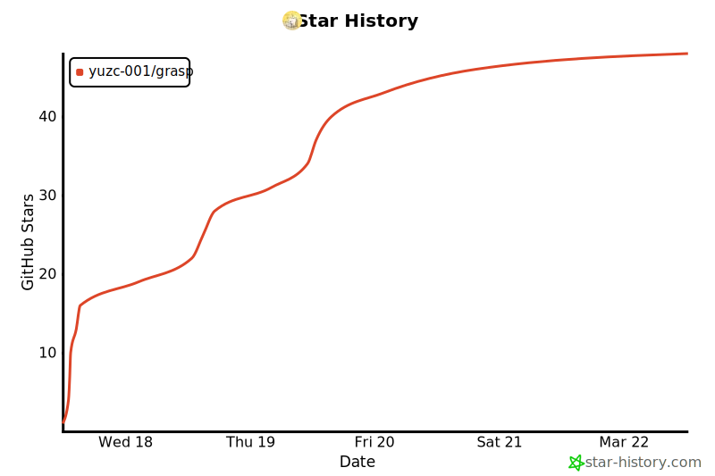

# Grasp

[English](./README.md) · [简体中文](./README.zh-CN.md) · [GitHub](https://github.com/Yuzc-001/grasp) · [Issues](https://github.com/Yuzc-001/grasp/issues)

[](./CHANGELOG.md)
[](./LICENSE)
[](./README.md#quickstart)
[](https://www.npmjs.com/package/grasp)

> **Grasp is an AI browser gateway: it enters, reads, acts, hands off, and resumes real web tasks with evidence.**

Grasp runs locally, keeps a dedicated `chrome-grasp` profile, and gives agents a browser session they can reuse instead of restarting from scratch every time.

Current package release: `v0.4.0`  
Public docs for the gateway surface: [docs/README.md](./docs/README.md)

---

## Why It Matters

Most browser automation breaks at exactly the wrong moment: after login, after a checkpoint, or after a human has to step in once.

Grasp is built for those real workflows:

- persistent browser sessions instead of throwaway tabs
- verified actions instead of blind `click` success
- compact page understanding instead of raw HTML dumps
- recoverable handoff and resume instead of starting over

What it does not claim:

- universal CAPTCHA bypass
- full autonomy on every gated site
- magic recovery without visible evidence

---

## Quickstart

### 1. Start Grasp

```bash
npx grasp
```

This detects Chrome, launches the dedicated `chrome-grasp` profile, and helps you connect your AI client.

### 2. Connect your client

Claude Code:

```bash
claude mcp add grasp -- npx -y grasp
```

Claude Desktop / Cursor:

```json
{
  "mcpServers": {
    "grasp": {
      "command": "npx",
      "args": ["-y", "grasp"]
    }
  }
}
```

Codex CLI:

```toml
[mcp_servers.grasp]
type = "stdio"
command = "npx"
args = ["-y", "grasp"]
```

### 3. Use the gateway flow

Start with the high-level tools:

- `entry` to open a task URL with session-aware strategy
- `inspect` to see whether the page is ready, gated, or waiting on handoff
- `extract` to read the page content
- `continue` to decide the next step without firing a browser action

Reference: [docs/reference/mcp-tools.md](./docs/reference/mcp-tools.md)
Manual smoke playbook: [docs/reference/smoke-paths.md](./docs/reference/smoke-paths.md)

---

## Gateway Workflows

### Direct read

Use `entry` -> `inspect` -> `extract` when the page is already readable.

What you get:

- current page status
- readable content
- a suggested next action

### Session-aware entry

Use `entry` first even when you think a direct navigation is fine.

`entry` can surface strategy evidence such as:

- direct entry is fine
- warm up the host with `preheat_session`
- stop and move into handoff

### Handoff and resume

When a human step is required, keep the workflow continuous instead of pretending it is fully autonomous:

1. `entry` or `continue` shows the page is gated
2. `request_handoff` records the required human step
3. `mark_handoff_done` marks the step complete
4. `resume_after_handoff` reacquires the page with continuation evidence
5. `continue` decides what should happen next

Product story: [docs/product/ai-browser-gateway.md](./docs/product/ai-browser-gateway.md)

---

## Safe Real Form Tasks

When the page is a real form, use the form-task flow:

`form_inspect` -> `fill_form` / `set_option` / `set_date` -> `verify_form` -> `safe_submit`

The default behavior is conservative:

- `fill_form` only writes safe fields
- `review` and `sensitive` fields stay visible so you can inspect them explicitly
- `safe_submit` starts with preview, so you can check blockers before any real submit

Form-task reference: [docs/reference/mcp-tools.md](./docs/reference/mcp-tools.md)

---

## Dynamic Authenticated Task Flows

Use `workspace_inspect -> select_live_item -> draft_action -> execute_action -> verify_outcome`
when the current page is a dynamic authenticated workspace. By default Grasp drafts first,
requires explicit confirmation for irreversible actions, and verifies that the workspace really
moved to the next state.

Workspace task reference: [docs/reference/mcp-tools.md](./docs/reference/mcp-tools.md)

---

## Advanced Runtime Primitives

The gateway tools are the public default. The lower-level runtime is still available when you need tighter control.

Common advanced primitives:

- navigation and state: `navigate`, `get_status`, `get_page_summary`
- interaction map: `get_hint_map`
- verified actions: `click`, `type`, `hover`, `press_key`, `scroll`
- observation: `watch_element`
- session strategy and handoff helpers: `preheat_session`, `navigate_with_strategy`, `session_trust_preflight`, `suggest_handoff`, `request_handoff_from_checkpoint`, `request_handoff`, `mark_handoff_in_progress`, `mark_handoff_done`, `resume_after_handoff`, `clear_handoff`

Full reference: [docs/reference/mcp-tools.md](./docs/reference/mcp-tools.md)

---

## CLI

| Command | Description |
|:---|:---|
| `grasp` / `grasp connect` | Set up the local browser gateway |
| `grasp status` | Show connection state, current tab, and recent activity |
| `grasp logs` | View audit log (`~/.grasp/audit.log`) |
| `grasp logs --lines 20` | Show the last 20 log lines |
| `grasp logs --follow` | Stream the audit log |

## Docs

- [docs/README.md](./docs/README.md)
- [docs/product/ai-browser-gateway.md](./docs/product/ai-browser-gateway.md)
- [docs/reference/mcp-tools.md](./docs/reference/mcp-tools.md)
- [docs/reference/smoke-paths.md](./docs/reference/smoke-paths.md)

## Releases

- [CHANGELOG.md](./CHANGELOG.md)
- [docs/release-notes-v0.4.0.md](./docs/release-notes-v0.4.0.md)

## License

MIT — see [LICENSE](./LICENSE).

## Star History

[](https://star-history.com/#Yuzc-001/grasp&Date)
